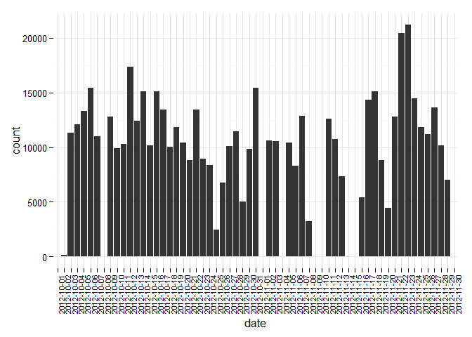
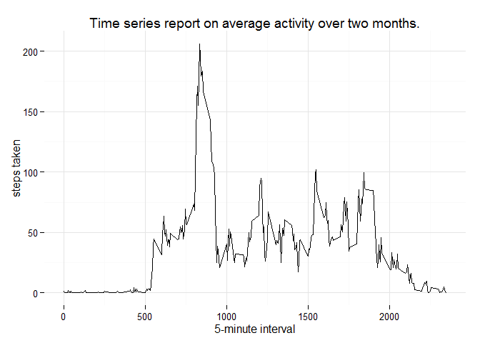
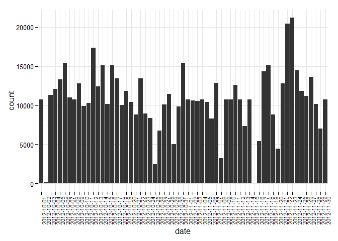
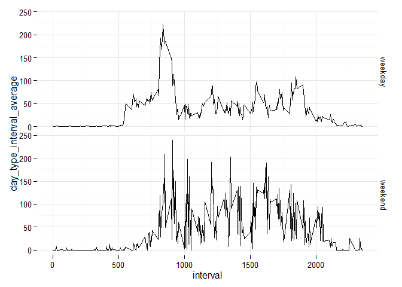

# Reproducible Research: Peer Assessment 1


## Loading and preprocessing the data
First unzip the **"activity.zip"** file.

```r
unzip('activity.zip')
```

Next read the **"activity.csv"** file into a data.table using the
fread call. This data.table will serve as the base for the 
remainder of the study.

```r
library(data.table)
# Read the data into a data.table
activity <- fread( 'activity.csv',
        header=TRUE, sep=",", na.strings = "NA",
        colClasses=c('numeric', 'Date', 'numeric')
    )
# Define the indexing key on the data.table
setkey(activity, date)
```


## What is mean total number of steps taken per day?

```r
library(ggplot2)

# 1. Calculate steps taken per day.
activity[, daily_steps:=sum(steps), by=date]
```

```
##        steps       date interval daily_steps
##     1:    NA 2012-10-01        0          NA
##     2:    NA 2012-10-01        5          NA
##     3:    NA 2012-10-01       10          NA
##     4:    NA 2012-10-01       15          NA
##     5:    NA 2012-10-01       20          NA
##    ---                                      
## 17564:    NA 2012-11-30     2335          NA
## 17565:    NA 2012-11-30     2340          NA
## 17566:    NA 2012-11-30     2345          NA
## 17567:    NA 2012-11-30     2350          NA
## 17568:    NA 2012-11-30     2355          NA
```

```r
# 2. Build a histogram of the steps taken for each day.
#   Use the steps as weight for this calculation.
plot <- qplot(date, data=activity, weight=steps)
#   theming
plot + theme_minimal() + theme(axis.text.x = element_text(angle=90, size = 8))
```



```r
# 3. Calculate and report the mean and median of the total number of steps taken.
# Subset the unique dates from the data table, returning the daily_steps vectors.
unique_days_steps <- unique(activity)$daily_steps

# Mean value for the number of steps observed daily.
mean(unique_days_steps, na.rm=TRUE)
```

```
## [1] 10766.19
```

```r
# Median value for the number of steps observed daily.
median(unique_days_steps, na.rm=TRUE)
```

```
## [1] 10765
```

## What is the average daily activity pattern?

```r
# Find the average by interval over all of the observed days
activity[,interval_average:=mean(steps, na.rm=TRUE),by=interval]
```

```
##        steps       date interval daily_steps interval_average
##     1:    NA 2012-10-01        0          NA        1.7169811
##     2:    NA 2012-10-01        5          NA        0.3396226
##     3:    NA 2012-10-01       10          NA        0.1320755
##     4:    NA 2012-10-01       15          NA        0.1509434
##     5:    NA 2012-10-01       20          NA        0.0754717
##    ---                                                       
## 17564:    NA 2012-11-30     2335          NA        4.6981132
## 17565:    NA 2012-11-30     2340          NA        3.3018868
## 17566:    NA 2012-11-30     2345          NA        0.6415094
## 17567:    NA 2012-11-30     2350          NA        0.2264151
## 17568:    NA 2012-11-30     2355          NA        1.0754717
```

```r
# Build the time series
plot <- qplot(
    interval, interval_average, data=activity,
    geom="line", xlab="5-minute interval", ylab="steps taken",
    main="Time series report on average activity over two months."
)
plot + theme_minimal()
```



```r
# Obtain the most active interval period
max_row <- activity$interval_average == max(activity$interval_average)
most_active_interval <- unique(activity[max_row,]$interval)
```

The most active interval is **835**

## Imputing missing values

```r
na_activity_filled <- copy(activity)
# 1. Get the number of rows with NAs
nrow(na_activity_filled[is.na(na_activity_filled$steps),])
```

```
## [1] 2304
```

```r
# 2. Fill in all NA values with the 5 minute interval mean calculated above.
na_activity_filled[is.na(na_activity_filled$steps), steps:=interval_average]
```

```
##            steps       date interval daily_steps interval_average
##     1: 1.7169811 2012-10-01        0          NA        1.7169811
##     2: 0.3396226 2012-10-01        5          NA        0.3396226
##     3: 0.1320755 2012-10-01       10          NA        0.1320755
##     4: 0.1509434 2012-10-01       15          NA        0.1509434
##     5: 0.0754717 2012-10-01       20          NA        0.0754717
##    ---                                                           
## 17564: 4.6981132 2012-11-30     2335          NA        4.6981132
## 17565: 3.3018868 2012-11-30     2340          NA        3.3018868
## 17566: 0.6415094 2012-11-30     2345          NA        0.6415094
## 17567: 0.2264151 2012-11-30     2350          NA        0.2264151
## 17568: 1.0754717 2012-11-30     2355          NA        1.0754717
```

```r
# 1. Calculate steps taken per day.
na_activity_filled[, daily_steps:=sum(steps), by=date]
```

```
##            steps       date interval daily_steps interval_average
##     1: 1.7169811 2012-10-01        0    10766.19        1.7169811
##     2: 0.3396226 2012-10-01        5    10766.19        0.3396226
##     3: 0.1320755 2012-10-01       10    10766.19        0.1320755
##     4: 0.1509434 2012-10-01       15    10766.19        0.1509434
##     5: 0.0754717 2012-10-01       20    10766.19        0.0754717
##    ---                                                           
## 17564: 4.6981132 2012-11-30     2335    10766.19        4.6981132
## 17565: 3.3018868 2012-11-30     2340    10766.19        3.3018868
## 17566: 0.6415094 2012-11-30     2345    10766.19        0.6415094
## 17567: 0.2264151 2012-11-30     2350    10766.19        0.2264151
## 17568: 1.0754717 2012-11-30     2355    10766.19        1.0754717
```

```r
# 2. Build a histogram of the steps taken for each day.
#   Use the steps as weight for this calculation.
plot <- qplot(date, data=na_activity_filled, weight=steps)
#   theming
plot + theme_minimal() + theme(axis.text.x = element_text(angle=90, size = 8))
```



```r
# 3. Calculate and report the mean and median of the total number of steps taken.
# Subset the unique dates from the data table, returning the daily_steps vectors.
unique_days_steps <- unique(na_activity_filled)$daily_steps

# Mean value for the number of steps observed daily.
mean(unique_days_steps, na.rm=TRUE)
```

```
## [1] 10766.19
```

```r
# Median value for the number of steps observed daily.
median(unique_days_steps, na.rm=TRUE)
```

```
## [1] 10766.19
```

* **Do the calculated values change from the first part of this assignment?**
    Yes.
    
* **What is the impact of inputting missing data on the estimates of the total daily steps?**
    First and most obviously any days with **NA** present in their record has an automatic increase to their values.
    This is most visual in the first few days where they're largely **NA** data.
    
    The method used to replace the NA values also brings the median and mean in-line with one another because the
    calculation being used was the mean for that interval period.


## Are there differences in activity patterns between weekdays and weekends?

```r
# Ensure all of the dates are date objects
activity$date <- as.Date(activity$date)
# Assign the week days
activity[,weekday := weekdays(date)]
```

```
##        steps       date interval daily_steps interval_average weekday
##     1:    NA 2012-10-01        0          NA        1.7169811  Monday
##     2:    NA 2012-10-01        5          NA        0.3396226  Monday
##     3:    NA 2012-10-01       10          NA        0.1320755  Monday
##     4:    NA 2012-10-01       15          NA        0.1509434  Monday
##     5:    NA 2012-10-01       20          NA        0.0754717  Monday
##    ---                                                               
## 17564:    NA 2012-11-30     2335          NA        4.6981132  Friday
## 17565:    NA 2012-11-30     2340          NA        3.3018868  Friday
## 17566:    NA 2012-11-30     2345          NA        0.6415094  Friday
## 17567:    NA 2012-11-30     2350          NA        0.2264151  Friday
## 17568:    NA 2012-11-30     2355          NA        1.0754717  Friday
```

```r
# Assign weekend vs weekday
weekend_days = c('Saturday', 'Sunday')
activity[weekday == weekend_days, day_type:='weekend']
```

```
##        steps       date interval daily_steps interval_average weekday
##     1:    NA 2012-10-01        0          NA        1.7169811  Monday
##     2:    NA 2012-10-01        5          NA        0.3396226  Monday
##     3:    NA 2012-10-01       10          NA        0.1320755  Monday
##     4:    NA 2012-10-01       15          NA        0.1509434  Monday
##     5:    NA 2012-10-01       20          NA        0.0754717  Monday
##    ---                                                               
## 17564:    NA 2012-11-30     2335          NA        4.6981132  Friday
## 17565:    NA 2012-11-30     2340          NA        3.3018868  Friday
## 17566:    NA 2012-11-30     2345          NA        0.6415094  Friday
## 17567:    NA 2012-11-30     2350          NA        0.2264151  Friday
## 17568:    NA 2012-11-30     2355          NA        1.0754717  Friday
##        day_type
##     1:       NA
##     2:       NA
##     3:       NA
##     4:       NA
##     5:       NA
##    ---         
## 17564:       NA
## 17565:       NA
## 17566:       NA
## 17567:       NA
## 17568:       NA
```

```r
activity[weekday != weekend_days, day_type:='weekday']
```

```
##        steps       date interval daily_steps interval_average weekday
##     1:    NA 2012-10-01        0          NA        1.7169811  Monday
##     2:    NA 2012-10-01        5          NA        0.3396226  Monday
##     3:    NA 2012-10-01       10          NA        0.1320755  Monday
##     4:    NA 2012-10-01       15          NA        0.1509434  Monday
##     5:    NA 2012-10-01       20          NA        0.0754717  Monday
##    ---                                                               
## 17564:    NA 2012-11-30     2335          NA        4.6981132  Friday
## 17565:    NA 2012-11-30     2340          NA        3.3018868  Friday
## 17566:    NA 2012-11-30     2345          NA        0.6415094  Friday
## 17567:    NA 2012-11-30     2350          NA        0.2264151  Friday
## 17568:    NA 2012-11-30     2355          NA        1.0754717  Friday
##        day_type
##     1:  weekday
##     2:  weekday
##     3:  weekday
##     4:  weekday
##     5:  weekday
##    ---         
## 17564:  weekday
## 17565:  weekday
## 17566:  weekday
## 17567:  weekday
## 17568:  weekday
```

```r
# Add another column that tracks the average steps during a time interval plus day type 
#   combination.
activity[,day_type_interval_average:=mean(steps, na.rm=TRUE),by=list(interval, day_type)]
```

```
##        steps       date interval daily_steps interval_average weekday
##     1:    NA 2012-10-01        0          NA        1.7169811  Monday
##     2:    NA 2012-10-01        5          NA        0.3396226  Monday
##     3:    NA 2012-10-01       10          NA        0.1320755  Monday
##     4:    NA 2012-10-01       15          NA        0.1509434  Monday
##     5:    NA 2012-10-01       20          NA        0.0754717  Monday
##    ---                                                               
## 17564:    NA 2012-11-30     2335          NA        4.6981132  Friday
## 17565:    NA 2012-11-30     2340          NA        3.3018868  Friday
## 17566:    NA 2012-11-30     2345          NA        0.6415094  Friday
## 17567:    NA 2012-11-30     2350          NA        0.2264151  Friday
## 17568:    NA 2012-11-30     2355          NA        1.0754717  Friday
##        day_type day_type_interval_average
##     1:  weekday                1.97826087
##     2:  weekday                0.39130435
##     3:  weekday                0.15217391
##     4:  weekday                0.17391304
##     5:  weekday                0.08695652
##    ---                                   
## 17564:  weekday                1.58695652
## 17565:  weekday                3.80434783
## 17566:  weekday                0.17391304
## 17567:  weekday                0.26086957
## 17568:  weekday                1.23913043
```

```r
# Plot the two types (weekdays, weekends) and their respective average activites.
plot <- qplot(interval, day_type_interval_average, data=activity, facets=day_type ~ ., geom="line")
plot + theme_minimal()
```


